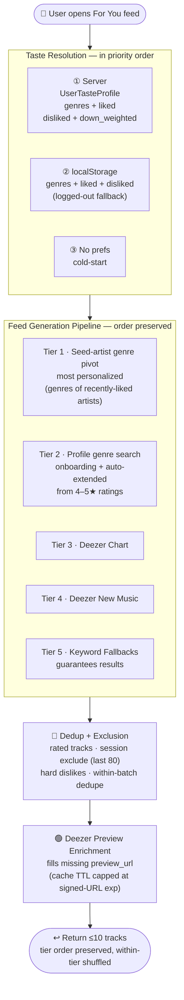

# Contour Personalization Architecture

## Current State — 5-Tier Discovery Feed

### Signals used today
| Signal | Source | Weight |
|---|---|---|
| Liked artist IDs (≥4★) | User ratings → `liked_artist_ids` (cap 20, newest-first) | High |
| Genre preferences | Onboarding picker + auto-extended on every 4–5★ rating from the rated artist's Spotify genres → `genres` (cap 20) | Medium |
| Down-weighted artists | 1–2★ ratings → `down_weighted_artist_ids` (soft exclude on tiers 1–2) | Negative-soft |
| Disliked artists | Explicit "Not interested" click → `disliked_artist_ids` (hard exclude all tiers) | Negative-hard |
| Already-rated tracks | DB `Rating` rows — track-level exclude on every request | Hard exclude |
| Session exclude | Last ~80 shown track IDs passed back from the client | Hard exclude |
| Global popularity | Deezer chart (real chart data, not text search) | Low (baseline) |
| Recency | Deezer new-music keyword search | Low (filler) |

### Current limitations
- Tiers 3–5 return similar tracks for every user — no per-user novelty on the baseline tiers
- No collaborative filtering ("users like you also liked…")
- No diversity cap — a single artist can occupy multiple slots in one batch
- Tier 1 silently produces zero results when seed artists have empty Spotify `genres` arrays (common for niche/indie acts) — algo falls through to baseline tiers and the batch looks un-personalized despite real signal
- Onboarding genres dominate tier 2 until enough 4–5★ ratings dilute them

### Recent improvements
- **Tier ordering preserved** — earlier `random.shuffle(result)` at the end of `/feed` was burying tier-1 personalized results under chart hits; now removed. Within-tier variety comes from a `_flatten_shuffle_add()` helper that shuffles each tier's gathered results as a single pool before they're added.
- **Cross-batch dedupe** — `/feed` now honors an `exclude` query parameter; the client passes the last ~80 shown track IDs on prefetch. Prevents the same Deezer chart hits from reappearing in successive batches while the chart cache is warm.
- **Genre auto-extension from ratings** — `UserTasteProfile.genres` used to be onboarding-only; now every 4–5★ rating merges the rated artist's Spotify genres into the profile (cap 20, newest-first). Tier 2 follows evolving taste instead of staying frozen at day-1 picks.
- **Negative signals split** — hard dislikes ("Not interested") exclude on every tier; 1–2★ down-weights only suppress tiers 1–2 so a single low rating doesn't blackhole an artist from charts. A subsequent 4–5★ rating supersedes the down-weight automatically.

---

## Proposed Future State — Layered Personalization

> ★ = new or improved vs current state

### Roadmap

#### Short-term (< 1 sprint)
- [x] **Dislike / skip button** on For You cards — `disliked_artist_ids` (hard exclude) + 1–2★ down-weight (soft exclude on tiers 1–2)
- [x] **Cross-batch dedupe** — `/feed` honors `exclude=<track_ids>`; client passes last 80
- [x] **Genre evolution from ratings** — `UserTasteProfile.genres` auto-extended on every 4–5★ rating
- [ ] **Tier-1 fallback to artist top tracks** — when a seed artist has no Spotify `genres` (common for niche acts), use `get_artist_top_tracks` as the seed instead. Currently the highest-quality improvement on the table: it fixes the silent zero-results case for users whose favorites have sparse metadata.
- [ ] **Diversity cap** — max 2 tracks per artist per batch (1-line change in `_make_adder()`)
- [ ] **Genre weight map** instead of binary list — 4★ = +0.3, 5★ = +0.5, 1★ = −0.4

#### Medium-term (1–2 sprints)
- [ ] **Community trending tier** — query `ratings` for tracks with most 4–5★ in last 7 days
- [ ] **2nd-degree related artists** — synthesize via seed artist's top track features (Spotify deprecated `/related-artists` for non-Extended-Access apps in late 2024)
- [ ] **Era preference detection** — infer preferred decades from rated tracks' release years
- [ ] **Auto-refresh expired previews** — when an `<audio>` element fires `onerror` (e.g. user idled past the 15-min signed-URL expiry), fetch a fresh preview URL and retry once instead of leaving the card silently un-playable

#### Long-term
- [ ] **Collaborative filtering** — cosine similarity on genre_weight vectors; requires ~1K+ active raters
- [ ] **Audio feature embeddings** — Spotify audio features API (tempo, energy, valence) for proximity-based recommendations
- [ ] **Sequence-aware ranking** — avoid repeating the same session opener every time
