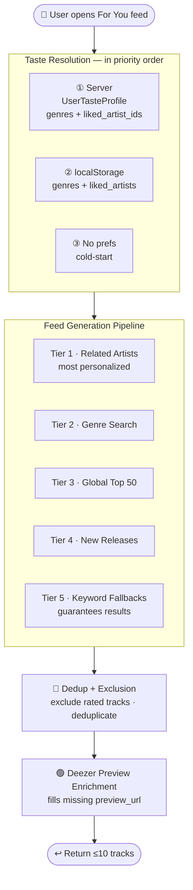
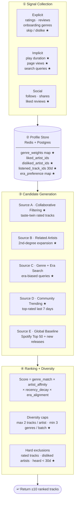

# Contour Personalization Architecture

## Current State — 5-Tier Discovery Feed

### Signals used today
| Signal | Source | Weight |
|---|---|---|
| Liked artist IDs (≥4★) | User ratings → DB taste profile | High |
| Genre preferences | Onboarding picker + ratings → DB | Medium |
| Global popularity | Spotify Top 50 | Low (baseline) |
| Recency | New releases | Low (filler) |

### Current limitations
- Tiers 3 & 5 return the same tracks for every user — no novelty for power users
- No negative signals (skip / dislike)
- No collaborative filtering ("users like you also liked…")
- No diversity cap — can flood the feed with one artist
- Cold-start requires 5 ratings before personalization kicks in

---

## Proposed Future State — Layered Personalization

> ★ = new or improved vs current state

### Roadmap

#### Short-term (< 1 sprint)
- [ ] **Dislike / skip button** on For You cards → negative artist weight in taste profile
- [ ] **Diversity cap** — max 2 tracks per artist per batch (1-line change in `_add()`)
- [ ] **Genre weight map** instead of binary list — 4★ = +0.3, 5★ = +0.5, 1★ = −0.4

#### Medium-term (1–2 sprints)
- [ ] **Community trending tier** — query `ratings` for tracks with most 4–5★ in last 7 days
- [ ] **2nd-degree related artists** — one extra async call per liked artist
- [ ] **Era preference detection** — infer preferred decades from rated tracks' release years

#### Long-term
- [ ] **Collaborative filtering** — cosine similarity on genre_weight vectors; requires ~1K+ active raters
- [ ] **Audio feature embeddings** — Spotify audio features API (tempo, energy, valence) for proximity-based recommendations
- [ ] **Sequence-aware ranking** — avoid repeating the same session opener every time
